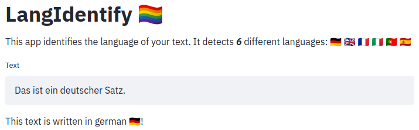
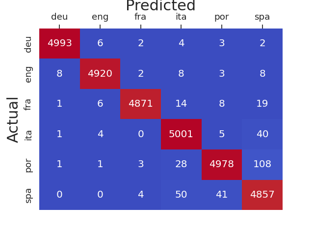

# LangIdentify 🏳️‍🌈

This repository includes code to train and evaluate a language identification model as well as code to launch a small web-application and interactively test the model.

## Trained model 💪
A pre-trained model is available [here](/checkpoints/model.pth).
It is trained on a balanced dataset of 240k sentences in german 🇩🇪, english 🇬🇧, frensh 🇫🇷, italian 🇮🇹, portuguese 🇵🇹 and spanish 🇪🇸.

**Accuracy** 🎯: 98.73%

**Confusion matrix 🤯**:






## Demo application 🔥
Test the model with the demo application. Start the app with `$ streamlit run app.py`. Then, open http://localhost:8501/ in your browser.


## Install requirements ⚙️
```
$ conda create -n langidentify python=3.8
$ conda activate langidentify
(Please check https://pytorch.org/get-started/locally/ and select the correct command depending on your CUDA version.)
$ conda install pytorch==1.7.1 torchvision==0.8.2 torchaudio==0.7.2 cudatoolkit=10.1 -c pytorch
$ pip install -r requirements.txt
```

## Model training, evaluation & testing
1. Download the dataset [here](https://downloads.tatoeba.org/exports/sentences.csv) and save the sentences.csv file under data/sentences.csv.
2. Filter the data with `$ python filter_dataset.py`. This creates a balanced dataset and a train, val, test split of 80/10/10 for 6 languages.
3. Pre-process the dataset with `$ python preprocess_dataset.py`. This generates a feature representation (most common trigrams) for the data.
4. Run `$ python main.py` with mode set to TRAIN (default), EVAL or TEST. The trained model is saved under checkpoints/model.pth by default.

For reproducibility, the random seed is set to _42_ in `filter_dataset.py` and _420_ in `main.py`. You might want to change these numbers to obtain different results.  
